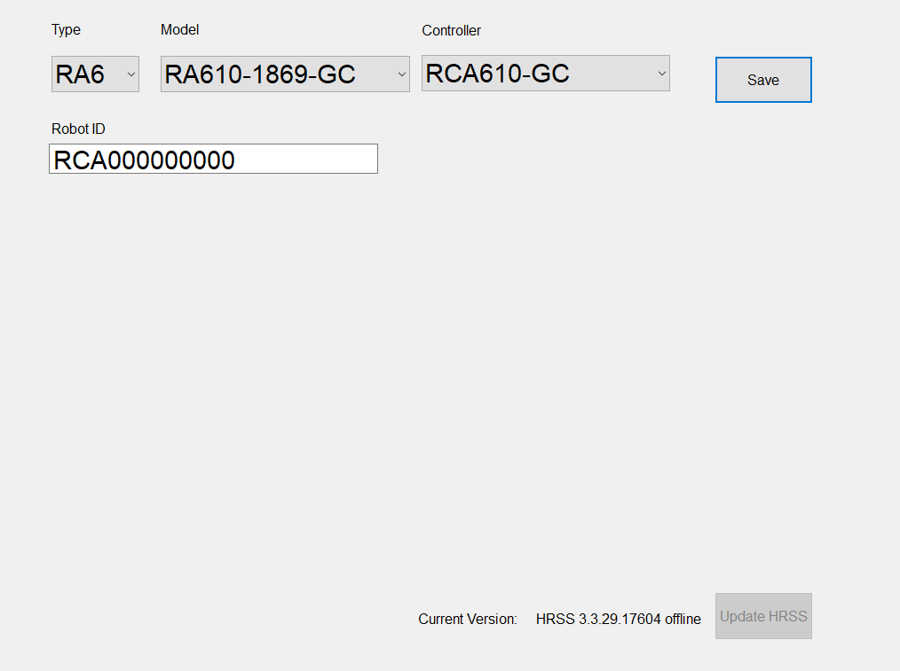
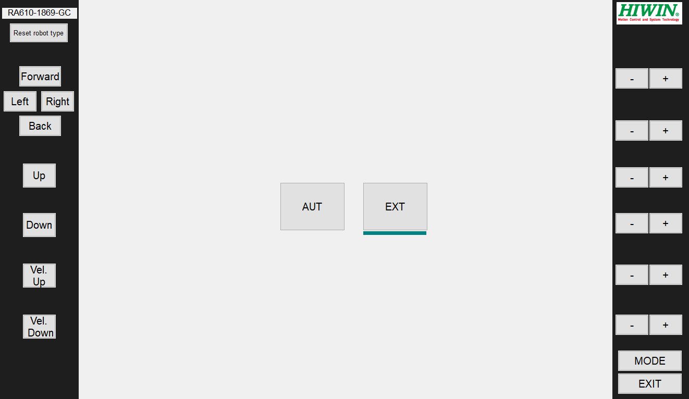

# HIWIN Robot ROS

[](https://opensource.org/licenses/Apache-2.0)
[](https://opensource.org/licenses/BSD-3-Clause)

This is a ROS package developed based on the [ROS-Industrial](http://wiki.ros.org/Industrial) guidelines, designed to support the integration and application development of HIWIN products. The package aims to provide efficient and standardized solutions for industrial robotics.

## Contents
This repository follows branch naming aligned with ROS distributions.
- Stable branches: `indigo`, `kinetic`
- Development branches: `*-devel` (may be unstable)

## Features
- **Best Practices:** Developed in adherence to [ROS-Industrial Training](https://wiki.ros.org/Industrial/Tutorials) guidelines for standardized and efficient robotics integration.
- **Integration with `ros_control`:** Provides a well-structured framework and standardized interfaces making it ideal for applications such as robotic arms, mobile robots, and more.
- **HIWIN Hardware Support:** Optimized for seamless communication and control of HIWIN robotic hardware.
- **MoveIt Integration:** Enables motion planning, trajectory execution, and manipulation tasks.
- **Robot Drivers:** Built on top of the [hiwin_robot_client_library](https://github.com/HIWINCorporation/hiwin_robot_client_library) (currently under development) to support position control for HIWIN robots.

## Dependencies 
To use this package, ensure you have the following dependencies installed:
- ROS Industrial Packages:
  - `industrial_robot_client`
  - `industrial_robot_simulator`
- ROS Control packages:
  - `controller_manager`
- ROS Controller packages:
  - `joint_state_controller`

## General Requirements
- **Operating System:** Ubuntu 20.04 LTS
- **ROS version:** Noetic Ninjemys

## Getting Started
1. **Install ros packages**
Follow the steps outlined in the [ROS Noetic installation instructions](https://wiki.ros.org/noetic/Installation).
2. **Source the ROS Environment**
```bash
source /opt/ros/noetic/setup.bash
```
3. **Create a ROS Workspace**
```bash
mkdir -p $HOME/catkin_ws/src
```
4. **Clone the Repository and Build**
```bash
# change to the root of the Catkin workspace
$ cd $HOME/catkin_ws

# retrieve the sources
$ git clone -b noetic-devel https://github.com/HIWINCorporation/hiwin_ros.git src/

# check build dependencies. Note: this may install additional packages,
# depending on the software installed on the machine
$ rosdep update

# be sure to change 'noetic' to whichever ROS release you are using
$ rosdep install --from-paths src/ --ignore-src --rosdistro noetic

# build the workspace (using catkin_tools)
$ catkin_make

# activate this workspace
$ source $HOME/catkin_ws/devel/setup.bash
```

## Usage
### :warning: **SAFETY FIRST**:warning:
*It is strongly recommended to test your code in simulation before using it on physical hardware.*

When testing with physical robots, ensure:
1. Emergency stop functionality is operational.
2. The workspace is clear of obstacles and personnel.
3. Speed and acceleration limits are properly set.

---

### Industrial robot simulator
To test the robot in a simulated environment:
```bash
$ roslaunch hiwin_ra610_1869_moveit_config moveit_planning_execution.launch sim:=true
```

---

### Real Robot Control
To connect to and control a physical robot:
```bash
$ roslaunch hiwin_driver ra6_bringup.launch ra_type:=ra610_1869 robot_ip:=<robot ip>
```

---

### HRSS Offline Simulation
The **HIWIN Robot System Software (HRSS)** provides tools for offline simulation and testing.

#### System Requirements
| **Component**        | **Requirement**          |
|-----------------------|--------------------------|
| **Operating System**  | Microsoft Windows        |
| **Screen Resolution** | 1360x768 or higher       |

#### Steps
1. **Download HRSS Offline**  
   Obtain the software from the [HIWIN Download Center](https://www.hiwinsupport.com/download_center.aspx?pid=MAR).

2. **Start HRSS Offline**  
   - Select the robot model (e.g., `RA610-1869`).
   - Enable **EXT Mode**.
     
     

3. **Control the Simulated Robot with MoveIt!**  
   ```bash
   roslaunch hiwin_ra610_1869_moveit_config moveit_planning_execution.launch sim:=false robot_ip:=<workstation ip>
   ```

---
